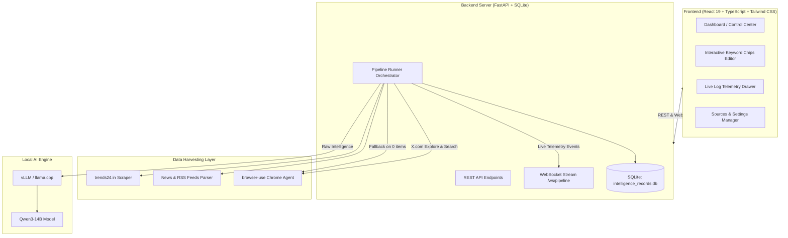

# 🌐 Autonomous Multi-Source News & Intelligence Agent

[](https://python.org)
[](https://fastapi.tiangolo.com)
[](https://react.dev)
[](https://www.typescriptlang.org)
[](https://tailwindcss.com)
[](https://sqlite.org)
[](https://github.com/browser-use/browser-use)
[](https://vllm.ai)

An autonomous, multi-source Open-Source Intelligence (OSINT) and news mining engine. It combines high-speed RSS/HTTP scrapers, real headful/headless Chrome browser agents, and local vision-language model synthesis (Qwen3-14B on vLLM) to extract breaking national and geopolitical trends, mine genuine X.com timeline posts, and synthesize high-precision boolean search keywords.

Included is a modern **FastAPI** backend with real-time **WebSocket telemetry** and a **React 19 + TypeScript + Tailwind CSS** dashboard featuring a **shadcn/ui** layout.

---

## 📑 Table of Contents

- [Key Capabilities](#-key-capabilities)
- [System Architecture](#-system-architecture)
- [Repository Structure](#-repository-structure)
- [Prerequisites](#-prerequisites)
- [Installation & Setup](#-installation--setup)
- [Running the CLI Pipeline](#-running-the-cli-pipeline)
- [Running the Full-Stack Web Application](#-running-the-full-stack-web-application)
- [Scraping Engine & Fallback Logic](#-scraping-engine--fallback-logic)
- [API & WebSocket Protocol](#-api--websocket-protocol)
- [Configuration Reference](#-configuration-reference)
- [Codebase Guidelines](#-codebase-guidelines)

---

## ⚡ Key Capabilities

### 1. Multi-Source Intelligence Gathering
- **Regional & Global Trends**: Scrapes real-time ranked hashtags from `trends24.in` across configured countries.
- **Configurable News Outlets**: Pulls headlines dynamically from web publications and RSS feeds (Dawn, Express Tribune, The News International, Defense News, Breaking Defense, Foreign Affairs, BBC World).
- **Hybrid Scraper with Browser Fallback**: Queries feeds in parallel via sub-second HTTP/RSS. If an outlet returns 0 headlines (due to bot-protection, 403, or broken RSS XML), it automatically spawns a headless Chrome browser agent to render the dynamic DOM and extract live headlines.

### 2. Autonomous X.com Deep Timeline Mining
- **Headful or Headless Chrome Automation**: Connects directly to real Chrome profiles via `browser-use` and Chrome DevTools Protocol (CDP), retaining logged-in sessions and bypassing aggressive bot checkpoints.
- **Progressive Scrolling**: Automatically navigates to X.com search timelines and scrolls iteratively until at least 20 genuine tweets per trending topic are harvested.
- **Noise-Free Tweet Extraction**: Splits DOM state specifically by `<article role=article />` containers, completely isolating genuine user tweets from sidebars, search suggestions, and promoted ad cards.

### 3. Local LLM Keyword Synthesis (vLLM / llama.cpp)
- Consolidates all raw data into `raw_sources.json`.
- Feeds news articles, trending hashtags, and timeline tweets into a local **Qwen3-14B Instruct** model.
- Generates 20+ comprehensive, multi-lingual (English, Urdu, Arabic) boolean-ready search keywords per topic categorized by domain (National Security, Diplomacy, Domestic Politics, Defense, Technology).

### 4. Interactive Full-Stack Control Center
- **shadcn/ui Dashboard Layout**: Fluid, responsive workspace with permanent or collapsible navigation and dark-mode styling.
- **Live WebSocket Telemetry**: Streaming log console with color-coded filters (`[INFO]`, `[STEP]`, `[SUCCESS]`, `[WARN]`, `[ERROR]`, `[BROWSER]`, `[SCROLL]`, `[LLM]`), auto-scroll lock, and copy buttons.
- **Interactive Keywords Editor**: Click-to-edit topic chips, remove noise terms with `✕`, add custom terms, or export directly to JSON and CSV.
- **Global Command Palette (`⌘K`)**: Quick-jump search modal to navigate across any page with keyboard shortcuts.
- **Sources Management**: Live toggle switches, delete actions, and auto-detecting URL submission (RSS vs. Web).
- **SQLite Persistence**: Complete run history with status, country, timestamps, raw data payloads, and full execution transcripts.

---

## 🏗️ System Architecture



---

## 📁 Repository Structure

```text
browser-agent/
├── app/
│   ├── backend/
│   │   ├── database.py              # SQLite schema, settings, and run history helpers
│   │   ├── main.py                  # FastAPI server (REST routes + WebSocket pipeline orchestrator)
│   │   ├── pipeline_runner.py       # Async procedural pipeline runner with granular live callbacks
│   │   └── requirements.txt         # FastAPI, uvicorn, and backend dependencies
│   └── frontend/
│       ├── components.json          # Official shadcn UI configuration
│       ├── package.json             # React 19, Tailwind, Lucide, clsx, tailwind-merge
│       ├── tailwind.config.js       # HSL design tokens and Nanami Medium font configuration
│       ├── vite.config.ts           # Vite bundler with @/ path alias
│       └── src/
│           ├── App.tsx              # Root component, routing, ⌘K command modal, WebSocket listener
│           ├── types.ts             # TypeScript interfaces (Sources, Runs, Keywords, Settings)
│           ├── index.css            # shadcn dark-mode CSS variables & typography rules
│           ├── components/
│           │   ├── LogPanel.tsx     # Resizable, collapsible live telemetry drawer
│           │   ├── Sidebar.tsx      # Grouped Linear/Vercel-style navigation
│           │   └── ui/
│           │       └── dashboard-sidebar.tsx # shadcn sidebar primitive with brand header
│           ├── lib/
│           │   └── utils.ts         # Standard cn() tailwind-merge utility
│           └── pages/
│               ├── DashboardPage.tsx# High-level statistics and recent execution table
│               ├── PipelinePage.tsx # Multi-country selector grid and run controller
│               ├── TrendsPage.tsx   # Ranked trending topics from trends24 and X.com
│               ├── HeadlinesPage.tsx# News headlines grouped into collapsible source cards
│               ├── TweetsPage.tsx   # Twitter-style cards with avatars, handles, and Urdu support
│               ├── KeywordsPage.tsx # Interactive keyword chips with click-to-edit and CSV export
│               ├── SourcesPage.tsx  # Source management with toggle switches & auto-detect URL form
│               ├── HistoryPage.tsx  # Historical SQLite runs with single-click inspection
│               └── SettingsPage.tsx # Live settings form for LLM and Chrome parameters
├── countries.json                   # Supported countries with tier flags & trends24 slugs
├── sources.json                     # Active intelligence news & RSS feed sources
├── raw_sources.json                 # Consolidated raw intelligence snapshot from latest run
├── keywords.json                    # Final synthesized keyword sets generated by LLM
├── trends.py                        # Standalone CLI pipeline runner
├── main.py                          # Starter script for ad-hoc browser-use tasks
├── requirements.txt                 # Core Python dependencies (browser-use, requests, bs4, etc.)
└── README.md                        # Documentation
```

---

## 📦 Prerequisites

1. **Python 3.11 or 3.12**
2. **Node.js 18+ & npm**
3. **Google Chrome** installed on your operating system
4. **Local LLM Endpoint**: vLLM or `llama.cpp` server running an OpenAI-compatible API (tested with `Qwen3-14B Instruct` / `Qwen3-VL`).

---

## 🚀 Installation & Setup

### 1. Clone Repository & Setup Python Environment

```bash
git clone https://github.com/hassanm57/browser-agent.git
cd browser-agent

# Create virtual environment
python3 -m venv .venv
source .venv/bin/activate

# Install core and backend dependencies
pip install -r requirements.txt
pip install -r app/backend/requirements.txt
```

### 2. Configure Environment Variables (`.env`)

Create a `.env` file in the project root:

```env
# Local Model Endpoint (OpenAI-compatible)
VLLM_BASE_URL=http://10.13.12.121:8000/v1
VLLM_API_KEY=EMPTY
LLM_MODEL=qwen3-14b

# Browser Configuration
HEADLESS=false          # Set to true to run Chrome silently in the background
USE_REAL_CHROME=true    # Attach to system Chrome profile to reuse existing sessions

# Telemetry
ANONYMIZED_TELEMETRY=false
```

### 3. Install Frontend Dependencies

```bash
cd app/frontend
npm install
cd ../..
```

---

## 💻 Running the CLI Pipeline

You can run the multi-source pipeline directly from your terminal:

```bash
source .venv/bin/activate

# Run for default country (Pakistan)
python trends.py

# Run for any specific country
python trends.py "United States"
python trends.py "India"
```

### CLI Execution Workflow:
1. Scrapes **trends24.in** for top hashtags.
2. Ingests all active news sources in **`sources.json`** via fast HTTP/RSS (with automatic headless browser fallback if a source returns 0 headlines).
3. Opens Chrome via **`browser-use`**, explores X.com trending tabs, and mines search timelines with progressive scrolling (target: 20+ tweets per trend).
4. Saves all raw harvested data to **`raw_sources.json`**.
5. Prompts local **Qwen3-14B** on vLLM to synthesize 20+ keywords per topic.
6. Writes structured output to **`keywords.json`** and logs a formatted summary in the terminal.

---

## 🖥️ Running the Full-Stack Web Application

To use the UI dashboard with real-time telemetry streaming:

### 1. Start the FastAPI Backend

```bash
source .venv/bin/activate
uvicorn app.backend.main:app --host 127.0.0.1 --port 8000 --reload
```
*Backend runs on `http://127.0.0.1:8000` (API Docs at `http://127.0.0.1:8000/docs`).*

### 2. Start the Vite Frontend

```bash
cd app/frontend
npm run dev -- --host 127.0.0.1
```
*Frontend runs on `http://127.0.0.1:5173`.*

Open **`http://127.0.0.1:5173`** in your browser.

---

## 🔄 Scraping Engine & Fallback Logic

Empirical benchmarks comparing headless browser automation against HTTP/RSS parsing revealed:
- **HTTP / RSS**: Sub-second execution (~8.8s across 9 outlets) and zero memory overhead, but prone to Cloudflare bot-checks or broken RSS endpoints (e.g. Breaking Defense RSS).
- **Headless Chrome**: Fully renders client-side JavaScript and rescues broken feeds, but incurs higher resource and latency costs (~150s for 9 outlets).

### The Hybrid Solution:
The engine executes a **fail-safe hybrid workflow**:
1. All news sources in `sources.json` are queried concurrently via fast HTTP/RSS.
2. If any source returns **`0` headlines**, the engine automatically derives the website's homepage and triggers a **headless browser agent** to load the dynamic DOM and extract live article titles.
3. This guarantees that no intelligence outlet is missed due to feed format errors or bot challenges.

---

## 📡 API & WebSocket Protocol

### REST Endpoints

| Method | Endpoint | Description |
| :--- | :--- | :--- |
| `GET` | `/api/health` | Service health status |
| `GET` | `/api/countries` | List of target countries and tier rankings |
| `GET` | `/api/sources` | Configured intelligence news and RSS sources |
| `POST` | `/api/sources` | Add a new news outlet or RSS feed |
| `PUT` | `/api/sources/{index}` | Toggle or edit a source |
| `DELETE` | `/api/sources/{index}` | Remove a source from `sources.json` |
| `GET` | `/api/runs` | Retrieve historical pipeline runs from SQLite |
| `GET` | `/api/runs/latest` | Get the most recent execution dataset |
| `GET` | `/api/runs/{id}` | Inspect a specific run with complete raw and synthesized data |
| `DELETE` | `/api/runs/{id}` | Delete a run record from SQLite |
| `PUT` | `/api/runs/{id}/keywords`| Save user-edited keywords back to disk and SQLite |
| `GET` | `/api/runs/{id}/export` | Export keywords as `json` or `csv` |
| `GET` | `/api/settings` | Read application settings from SQLite |
| `PUT` | `/api/settings` | Update settings (LLM URL, model, browser flags) |
| `POST` | `/api/pipeline/start` | Trigger pipeline execution via REST |
| `POST` | `/api/pipeline/cancel` | Abort a running pipeline job |

### WebSocket Protocol (`ws://localhost:8000/ws/pipeline`)

Connect to `ws://localhost:8000/ws/pipeline` for live bidirectional orchestration:

#### Client-to-Server Commands:
```json
// Start pipeline for specific countries
{ "action": "start", "countries": ["Pakistan", "United States"] }

// Cancel active execution
{ "action": "cancel" }
```

#### Server-to-Client Telemetry Stream:
```json
// Log message
{
  "type": "log",
  "level": "INFO" | "STEP" | "SUCCESS" | "WARN" | "ERROR" | "BROWSER" | "SCROLL" | "LLM",
  "timestamp": "14:32:05",
  "message": "Extracted 20 genuine tweets for #VisionaryFieldMarshal"
}

// Progress update
{
  "type": "progress",
  "phase": "x_mining",
  "current_step": 4,
  "total_steps": 6,
  "detail": "Mining X.com timeline tweets with Chrome..."
}

// Status change
{ "type": "status", "status": "running" | "completed" | "cancelled" | "error" }

// Completion payload
{ "type": "result", "data": { "raw_sources": { ... }, "keywords": { ... } } }
```

---

## ⚙️ Configuration Reference

Settings can be modified either via `.env` or in real-time from the **Settings Page** in the UI (persisted in SQLite):

| Parameter | Default Value | Description |
| :--- | :--- | :--- |
| `VLLM_BASE_URL` | `http://10.13.12.121:8000/v1` | OpenAI-compatible endpoint of your local LLM |
| `VLLM_API_KEY` | `EMPTY` | API key for local LLM authentication |
| `LLM_MODEL` | `qwen3-14b` | Model name to target on vLLM / llama.cpp |
| `LLM_MAX_TOKENS` | `8192` | Maximum token ceiling for keyword synthesis |
| `LLM_TIMEOUT` | `180` | Request timeout in seconds for heavy LLM prompts |
| `HEADLESS` | `false` | When `false`, Chrome window is visible on your desktop |
| `USE_REAL_CHROME` | `true` | Connects to system Chrome profile to preserve logins |
| `MAX_TWEETS_PER_TREND` | `20` | Minimum genuine tweets to extract before moving to next topic |
| `MAX_SCROLL_ROUNDS` | `12` | Maximum progressive scroll rounds per search timeline |
| `TRENDS_TO_MINE` | `5` | Number of top trending topics to mine tweets for |

---

## 📐 Codebase Guidelines

This repository follows strict code readability and junior-engineer maintainability rules:
- **Explicit Procedural Logic**: Step-by-step control flow avoiding unnecessary abstractions, magic methods, or deep inheritance hierarchies.
- **Traditional Iteration**: Prefers traditional `for` and `while` loops over complex functional chains (`map`, `reduce`, `filter`).
- **Descriptive Naming**: Long, fully spelled-out identifiers (`target_country_name`, `collected_tweets_for_trend`, `cancellation_event`) without cryptic abbreviations.
- **Explanatory Comments**: Code comments focus on *why* a step is necessary (e.g. why DOM containers are split by `<article role=article />`), rather than restating what the syntax does.

---

## 📄 License

This project is licensed under the MIT License.
